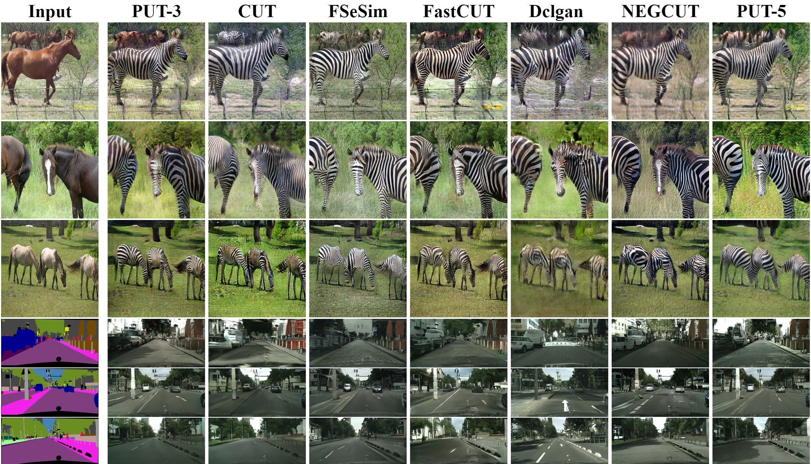

# Exploring Negatives in Contrastive Learning for Unpaired Image-to-Image Translation


<br>

  

<br><br><br>

We provide our PyTorch implementation of [Exploring Negatives in Contrastive Learning for Unpaired Image-to-Image Translation](https://arxiv.org/abs/2204.11018)(PUT).

In this paper, we propose a novel model called PUT for unpaired image-to-image translation. Compared with the previous contrastive learning methods, our proposed PUT is stable to learn the information between the corresponding patches, leading to a more effective contrast learning system

## Example Results
### Unpaired Image-to-Image Translation
<br>
 
<br>

### Single Image Unpaired Translation
  


## Getting Started

### Installation

- Clone this repo:

```bash
git clone https://github.com/YupeiLin2388/Exploring-Negatives-in-Contrastive-Learning-for-Unpaired-Image-to-Image-Translation PUT
cd PUT
```

- Install PyTorch and other dependencies (e.g., torchvision, visdom, dominate, gputil).

  For pip users, please type the command `pip install -r requirements.txt`

### [Datasets](https://github.com/taesungp/contrastive-unpaired-translation/blob/master/docs/datasets.md)

Please refer to the original [CUT](https://github.com/taesungp/contrastive-unpaired-translation) and [CycleGAN](https://github.com/junyanz/pytorch-CycleGAN-and-pix2pix) to download the horse2zebra and CityScapes datasets.

### Training

#### Horse2Zerba

```bash
python train.py --dataroot ./datasets/horse2zebra --name h2z_PUT5 --choose_patch 5 --batch_size 4 --gpu_id 0
```

#### CityScapes

```bash
python train.py   --name citys_PUT5   --choose_patch 5 --batch_size 4 --dataroot ./datasets/cityscapes/ --direction BtoA --gpu_id 0
```

####  Single Image Unpaired Training

```bash
python train.py --model sincut --name sinPUT5 --dataroot ./datasets/single_image_monet_etretat --choose_patch 5
```

### Testing

#### Horse2Zerba

```bash
python test.py --dataroot ./datasets/horse2zebra --name h2z_pretrained 
```

#### CityScapes

```bash
python test.py  --dataroot ./datasets/cityscapes/ --direction BtoA  --name CityScapes_pretrained 
```

### Pretrained Models

Download the pre-trained models using the following links and put them under`checkpoints/` directory.

horse2zebra:[google drive](https://drive.google.com/drive/folders/1WHlLcdwyoaYvXiHl-yOd6zZb-ja854_V?usp=sharing)

CityScape :[google drive](https://drive.google.com/drive/folders/1HYNhX4SbrqtC8Cv6kgl71hbIeKrz_ozO?usp=sharing)

image2monet:[google drive](https://drive.google.com/drive/folders/1xQ17DKW6faNXvksd87UGoLsYYeN3PAGV?usp=sharing)

### Evaluate

#### Horse2Zerba

We referred to the code of [F-LSeSim](https://github.com/lyndonzheng/F-LSeSim) and run `test_fid.py`  to calculate the FID value for each epoch. We stored the results of each epoch in `result.csv`.

```bash
python test_fid.py --dataroot ./datasets/horse2zebra --name h2z_pretrained --num_test 500   --gpu_id 0
```

#### CityScapes

For CityScapes dataset, we frist resize 256*128 then calculate the  FID

```bash
python test_fid.py --name citys_PUT5 --dataroot ./datasets/cityscapes/ --direction BtoA --num_test 500  --aspect_ratio 2.0 --gpu_id 0
```

For mIoU computation, we use [drn-22](https://github.com/fyu/drn).

```bash
python3 segment.py test -d <data_folder> -c 19 --arch drn_d_22     --pretrain ./checkpoint/drn_d_22_cityscapes.pth --phase test --batch-size 1
```

## Citation

If you use this code for your research, please cite our [paper](https://arxiv.org/abs/2204.11018).

```
@inproceedings{lin2022exploring,
  title={Exploring negatives in contrastive learning for unpaired image-to-image translation},
  author={Lin, Yupei and Zhang, Sen and Chen, Tianshui and Lu, Yongyi and Li, Guangping and Shi, Yukai},
  booktitle={Proceedings of the 30th ACM International Conference on Multimedia},
  pages={1186--1194},
  year={2022}
}
```

## Acknowledge

Our code is developed based on [CUT](https://github.com/taesungp/contrastive-unpaired-translation) and   [F-LSeSim](https://github.com/lyndonzheng/F-LSeSim) , we also thank , [drn](https://github.com/fyu/drn) for mIoU computation.
